# Guide d'utilisation — EnMKit

**Pilotez vos kits électriques par SMS, où que vous soyez, même sans Internet.**

Version de l'application : **1.0.0** · Document mis à jour le 13/06/2026

> ℹ️ **Note de version.** Cette édition du guide intègre les évolutions récentes :
> on parle désormais de **lignes** (et non plus de « relais »), le pilotage se fait par
> **deux boutons ON / OFF** dont l'état **reflète la confirmation réelle du kit**, le
> **code de sécurité est devenu optionnel**, l'édition d'une ligne se fait par
> **double-tap**, on choisit le **nombre de lignes à la création**, et de nouvelles
> **actions groupées** / **test de joignabilité** sont disponibles. 🆕 Chaque ligne
> dispose maintenant d'un **historique horodaté des accusés de réception** (icône
> **horloge**), qui **joint le message de confirmation réellement renvoyé par le kit** ;
> ces accusés sont captés de façon **fiable, même application fermée ou depuis un autre
> onglet**. La **sécurité** propose désormais, en plus du code, le **déverrouillage par
> empreinte** et des **questions de récupération** (« Code oublié ? »). Les captures de la
> nouvelle interface (boutons ON/OFF, onglet Lignes, double-tap, sélecteur de lignes,
> section Sécurité complète, historique des accusés) sont à jour.

---

## À qui s'adresse ce guide ?

Ce guide suit un **scénario concret** : celui d'un **bailleur** qui possède plusieurs
logements (Appartement A, B, C) et qui souhaite piloter à distance l'électricité de
chacun depuis un seul téléphone. Vous suivrez tout le parcours, **depuis l'installation
jusqu'à la gestion fine des lignes**, en passant par le **partage de configuration entre
deux téléphones par QR Code**.

> **Le principe d'EnMKit.** Chaque logement est équipé d'un *kit* (un boîtier relié à une
> carte SIM). L'application envoie des **SMS de commande** au numéro du kit pour allumer /
> couper les circuits (**lignes**) et relever la consommation. Aucune connexion Internet
> n'est nécessaire : tout passe par le réseau GSM.
>
> **Temps réel & multi-téléphones.** Quand le kit confirme une commande (il renvoie le
> message reçu), **tous les téléphones autorisés** mettent à jour l'état de la ligne.
> L'application **reste à l'écoute des SMS entrants même fermée**.

---

## 1. Premier lancement — l'accueil

À la première ouverture, l'application présente ses trois atouts en trois écrans.

| | |
|---|---|
| 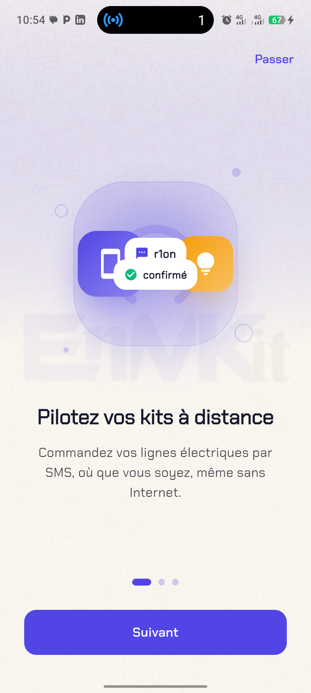 | 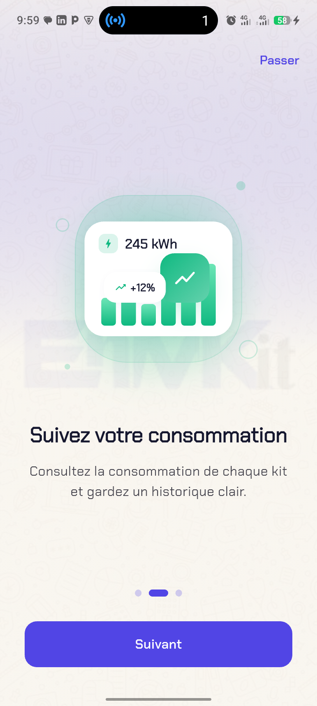 |
| **Pilotez vos kits à distance** — commandez vos lignes par SMS, sans Internet. | **Suivez votre consommation** — consultez la conso de chaque kit et gardez un historique. |

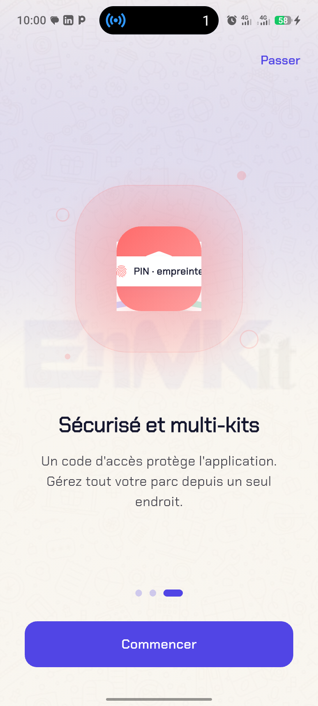

**Sécurisé et multi-kits** — un code d'accès *optionnel* peut protéger l'application, et
vous gérez tout votre parc depuis un seul endroit. C'est exactement ce dont un bailleur a
besoin.

Appuyez sur **Suivant** pour avancer, ou **Commencer** au dernier écran. (Le lien
**Passer** en haut à droite saute directement l'introduction.)

---

## 2. Code d'accès — proposé au 1er lancement, mais **skippable**

> 🆕 **Changement important.** Le code d'accès **n'est plus obligatoire**. Juste après
> l'introduction, l'application vous **propose** d'en créer un — mais cette étape
> comporte un bouton **« Passer pour l'instant »** : elle ne **bloque jamais** l'accès.

Deux choix s'offrent à vous sur cette page :

- **Créer un code** — saisissez un code (4 chiffres minimum) puis **confirmez-le**. Il
  protégera désormais l'ouverture de l'application.
- **« Passer pour l'instant »** — vous arrivez **directement** sur le tableau de bord,
  sans aucun code. Vous pourrez toujours l'activer plus tard.

| | |
|---|---|
| 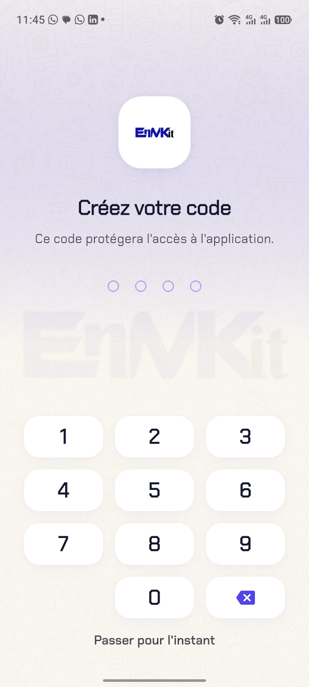 | 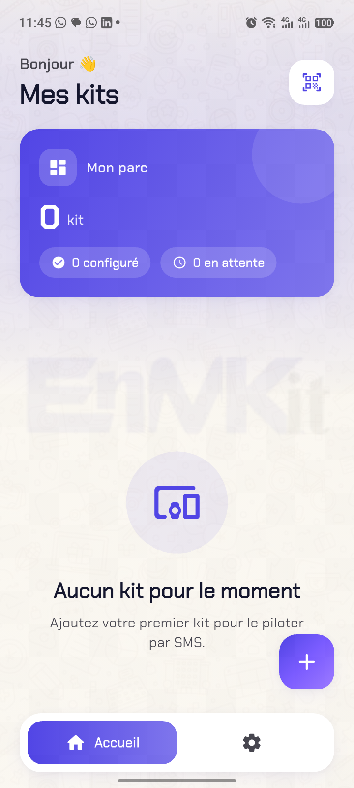 |
| **Créez votre code** — pavé numérique + bouton **« Passer pour l'instant »** sous le clavier : l'étape ne bloque jamais. | Après **« Passer pour l'instant »**, accès **direct** à « Mes kits », sans code. |

> 🔐 **Conseil.** Choisissez un code que vous retiendrez mais qui n'est pas évident
> (évitez 0000 ou 1234). Vous pourrez le **désactiver**, le **changer**, ou l'**activer**
> plus tard dans **Réglages → Sécurité** (voir §12).
>
> ℹ️ La proposition n'apparaît **qu'au premier lancement** : si vous passez (ou créez un
> code), elle n'est plus présentée aux ouvertures suivantes.

---

## 3. Le tableau de bord (vide au départ)

Vous arrivez sur **« Mes kits »**. Au tout début, **aucun kit n'est enregistré** :

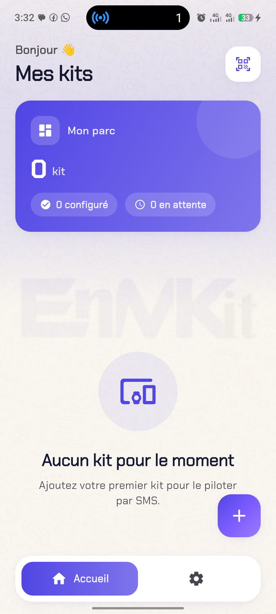

La carte **« Mon parc »** affiche le compte global : **0 kit, 0 configuré, 0 en attente**.
Le message *« Aucun kit pour le moment »* vous invite à ajouter votre premier kit avec le
bouton **+** en bas à droite.

---

## 4. Ajouter un appartement (et choisir le nombre de lignes)

Appuyez sur le bouton **+**. La fenêtre **« Nouveau kit »** s'ouvre : donnez un **nom** au
logement, le **numéro de la carte SIM** du kit, puis **choisissez le nombre de lignes**.

| | |
|---|---|
| 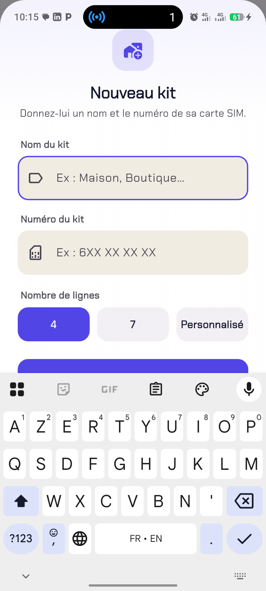 | 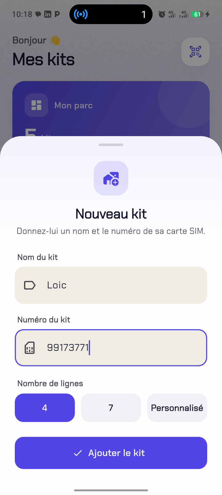 |
| Les champs **Nom du kit** et **Numéro GSM du kit**. | Renseignez par ex. *Appartement A* et *+237 6 90 11 22 33*. |

> 🆕 **Nombre de lignes.** Avant de valider, sélectionnez **4**, **7** ou
> **Personnalisé** (de 1 à 7). Les lignes sont créées automatiquement
> (*Ligne 1*, *Ligne 2*, …) — vous les renommerez ensuite (§7).

| | |
|---|---|
| 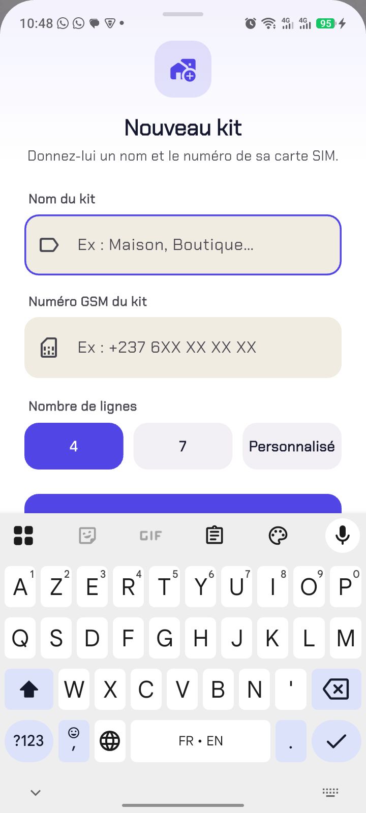 | 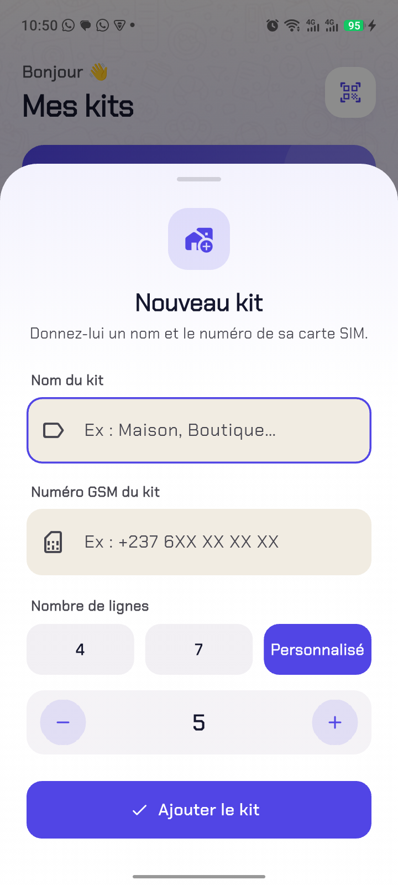 |
| Trois choix : **4**, **7** ou **Personnalisé**. | En **Personnalisé**, ajustez le nombre avec **− / +** (1 à 7). |

Appuyez sur **Ajouter le kit**.

> 💡 **Astuce nommage.** Donnez à chaque kit le nom du logement (*Appartement A*,
> *Appartement B*…) pour vous y retrouver d'un coup d'œil quand le parc grandit.

---

## 5. Votre parc complet

Répétez l'opération pour chaque logement. Notre bailleur a ainsi enregistré **trois
appartements** :

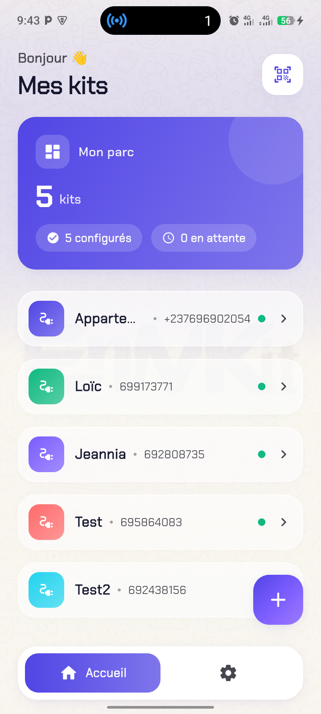

La carte **« Mon parc »** indique maintenant **3 kits, 3 configurés**. Chaque appartement
apparaît avec son **nom**, son **numéro GSM** et un **point de couleur** (statut). Touchez
une carte pour ouvrir le logement correspondant.

---

## 6. Piloter les lignes d'un logement

En ouvrant **Appartement A**, vous arrivez sur l'onglet **Lignes**. C'est le poste de
commande du logement.

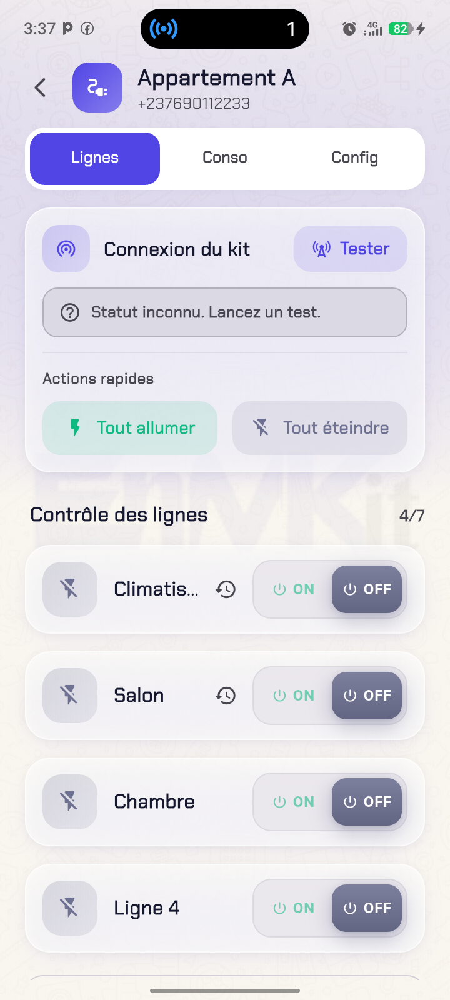

On y trouve :

- Les **trois onglets** du kit : **Lignes**, **Conso**, **Config**.
- Le compteur **« Contrôle des lignes 3/7 »** (un kit gère jusqu'à 7 circuits).
- 🆕 Une carte **« Connexion du kit »** avec un bouton **Tester** et une **bannière de
  statut** (voir §6.1).
- 🆕 Des **Actions rapides** : **Tout allumer** / **Tout éteindre** (voir §6.2).
- La liste des lignes (**Ligne 1, 2, 3…**), chacune avec son état (*Arrêtée / En marche*)
  et **deux boutons ON / OFF** pour l'allumer ou la couper par SMS.
- **« + Ajouter une ligne »** en bas.

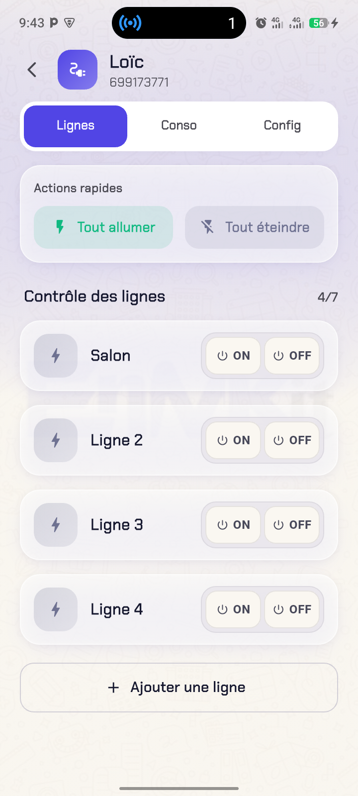

### 🆕 Les boutons ON / OFF et l'état réel

Chaque ligne a désormais **deux boutons distincts** : **ON** (vert) pour allumer, **OFF**
pour couper. Le bouton **plein** indique l'**état réellement confirmé par le kit**.

Le point important à comprendre :

> 🔑 **Appuyer envoie une commande — l'affichage ne bascule qu'à la réponse du kit.**
> Quand vous appuyez sur ON ou OFF, l'application envoie le SMS et la ligne passe en
> **« En attente… »** (petit cercle qui tourne, badge orange). L'état affiché **ne change
> pas tout de suite** : il bascule **seulement** quand le kit renvoie sa confirmation
> (`rXon` / `rXoff`).

Pourquoi ? Parce qu'un même kit peut être **piloté par plusieurs téléphones autorisés**.
Si une autre personne allume ou coupe une ligne, son kit envoie la confirmation **à tous**
les numéros autorisés : votre écran se met alors à jour **tout seul**, même application
fermée. Ainsi, ce que vous voyez correspond **toujours à l'état réel**, jamais à un simple
appui.

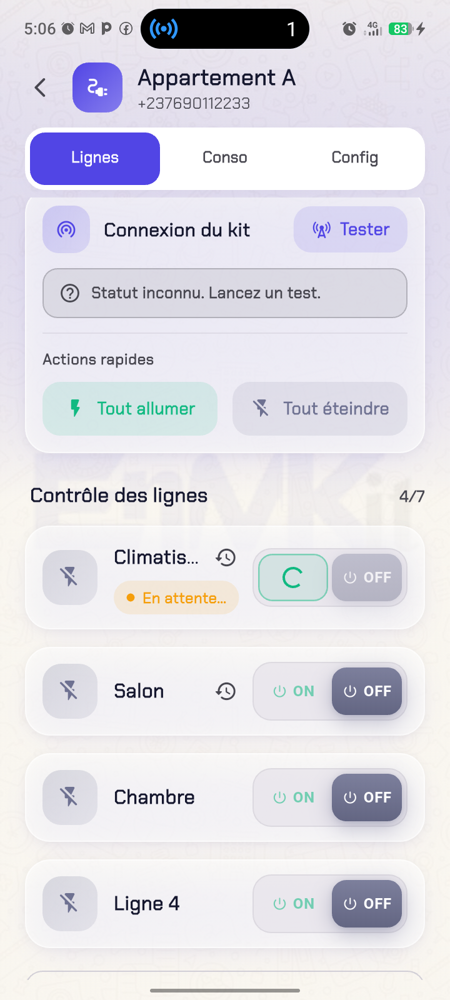

Concrètement :

- ⏳ Pendant l'attente, **les deux boutons de la ligne sont verrouillés** (le bouton non
  concerné apparaît grisé) : impossible d'appuyer sur l'autre tant que la commande en
  cours n'est pas terminée.
- ✅ Dès que le kit confirme, le bon bouton se **remplit** et le badge repasse en
  *En marche* ou *Arrêtée*.
- ⌛ Si le kit ne répond pas (hors crédit, hors réseau), l'attente se **lève seule** après
  un délai et la ligne revient au dernier état connu (la commande a tout de même été
  envoyée). Pensez alors à **Tester** la joignabilité (§6.1).

### 6.1 Tester la joignabilité du kit

🆕 Si le kit n'a plus de crédit SMS ou n'est pas joignable, mieux vaut le savoir. Appuyez
sur **Tester** dans la carte **« Connexion du kit »** : l'application envoie un petit
message (`cons`) au kit. La **bannière de statut** évolue :

| Statut | Signification |
|---|---|
| **Statut inconnu** | Aucun test lancé pour l'instant. |
| **Vérification…** | Le test est en cours (en attente de réponse). |
| **Joignable** | Le kit a répondu : tout va bien. |
| **Injoignable** | Pas de réponse dans le délai : vérifiez le crédit SMS et le réseau du kit. |

### 6.2 Actions groupées (tout allumer / tout éteindre)

🆕 Les boutons **Tout allumer** et **Tout éteindre** agissent sur l'ensemble des lignes du
kit en une fois. Pour éviter une rafale de SMS, l'application n'envoie une commande que
pour les lignes qui changent réellement d'état, en les espaçant légèrement.

### 6.3 🆕 L'historique des accusés de réception (icône horloge)

Chaque fois que le kit **confirme** une commande, sa réponse est **journalisée** : la ligne
concernée affiche alors une petite **icône horloge** à côté de son nom. Touchez-la pour
ouvrir l'**historique des accusés de réception** de cette ligne.

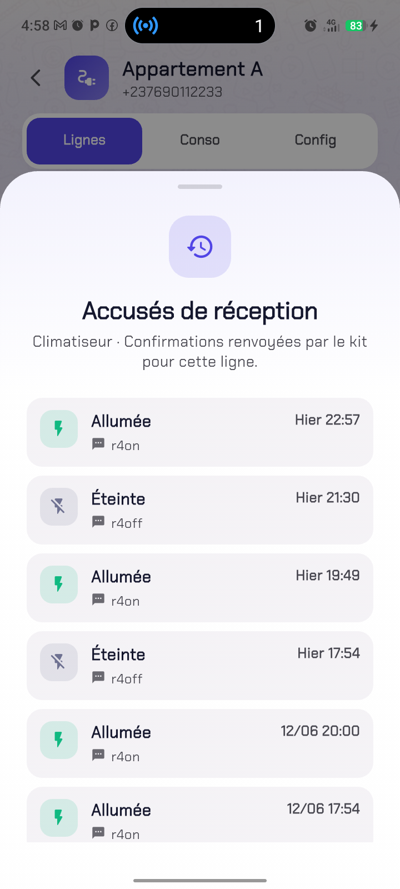

Chaque entrée indique :

- l'**action confirmée** — *Allumée* ou *Éteinte* ;
- le **message exact renvoyé par le kit** (l'accusé brut, ex. `r1on` / `r1off`), **joint**
  à l'entrée pour lever toute ambiguïté ;
- l'**heure** de la confirmation (*Aujourd'hui 22:57*, *Hier 20:00*, ou la date pour les
  plus anciennes).

> 🔑 **Pourquoi un historique plutôt qu'un simple voyant ?** Un voyant d'état unique
> pouvait laisser croire qu'un *ancien* accusé concernait votre *dernière* commande.
> L'historique horodaté, lui, rattache **chaque confirmation à son heure et à son message**,
> sans confusion possible.

> 📡 **Réception fiable.** Les accusés sont enregistrés **même si l'application est fermée**
> ou si vous êtes sur un **autre onglet** : à la réouverture (ou en temps réel), les
> confirmations reçues du kit viennent compléter l'historique automatiquement.

---

## 7. Gérer une ligne (double-tap, renommer, supprimer)

> 🆕 **Nouvelle interaction.** L'édition se fait par **double-tap** directement sur la
> ligne (plus de menu « … »). L'**ampérage a été retiré** : une ligne se résume à son
> **nom** et son **état**.

**Double-tapez** une ligne pour passer en **mode édition** : le nom devient un champ de
saisie, accompagné de deux boutons circulaires épurés —
**✓ vert** pour *valider* et **✕ rouge** pour *supprimer*.

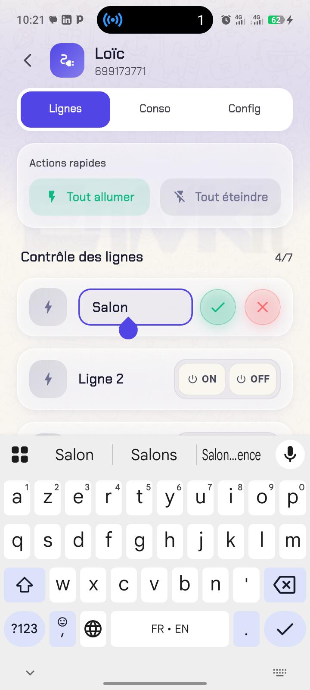

Pour un appartement, mieux vaut nommer les lignes selon ce qu'elles alimentent. Exemple :
renommer *Ligne 1* en **« Climatiseur »** ou *Ligne 2* en **« Chambre »** :

1. **Double-tap** sur la ligne → mode édition.
2. Effacez le nom et saisissez le nouveau (*Climatiseur*, *Chambre*, *Salon*, *Pompe*…).
3. Appuyez sur le **✓ vert** pour enregistrer (ou le **✕ rouge** pour supprimer la ligne).

La ligne s'affiche alors avec son nouveau nom — beaucoup plus parlant.

Pour **ajouter** un nouveau circuit, utilisez **« + Ajouter une ligne »** : donnez-lui
simplement un **nom**, puis validez.

---

## 8. Suivre la consommation

L'onglet **Conso** affiche la consommation électrique du logement.

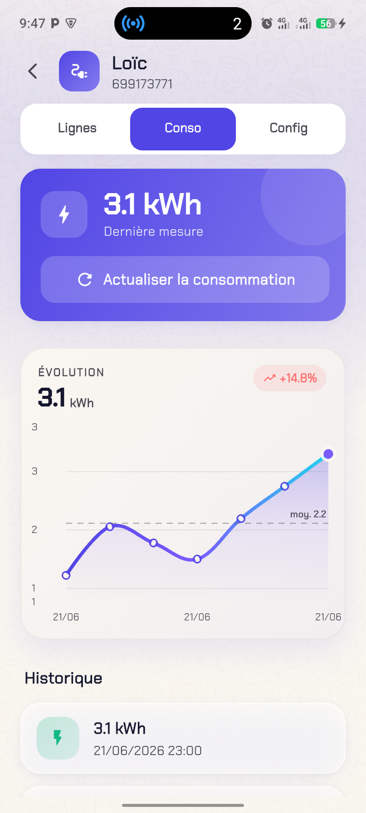

Au départ, aucune mesure n'est disponible. Appuyez sur **« Actualiser la consommation »**
pour interroger le kit : l'application envoie un SMS (`cons`) au kit, qui répond avec le
relevé. Les mesures s'accumulent ensuite dans l'**Historique**.

---

## 9. Configurer le kit

L'onglet **Config** regroupe tous les réglages du kit, ainsi que les deux actions clés en
bas de page.

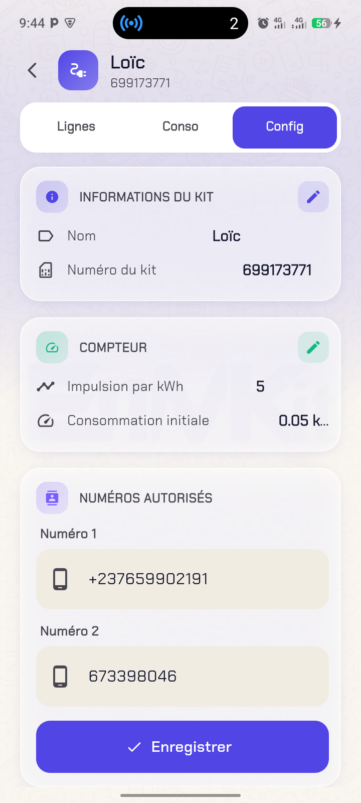

On y trouve trois cartes :

1. **Informations du kit** — nom et numéro GSM.
2. **Compteur** — nombre d'impulsions et consommation initiale.
3. **Numéros autorisés** — les numéros qui auront le droit de commander le kit par SMS.

Et deux boutons :

- **Envoyer la configuration au kit** — transmet les réglages au boîtier par SMS.
- **Générer le QR Code** — crée un QR Code de partage (voir §10).

### 9.1 Modifier les informations du kit

Touchez le **crayon** de la carte *Informations du kit* :

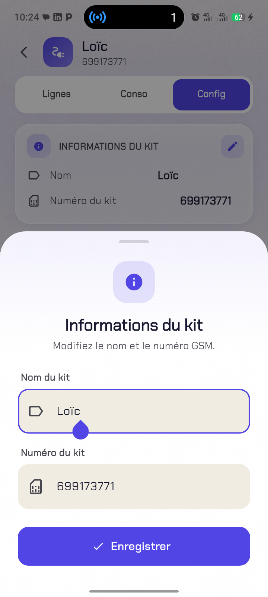

Vous pouvez corriger le **nom** et le **numéro GSM**, puis **Enregistrer**.

### 9.2 Régler le compteur

Touchez le **crayon** de la carte *Compteur* :

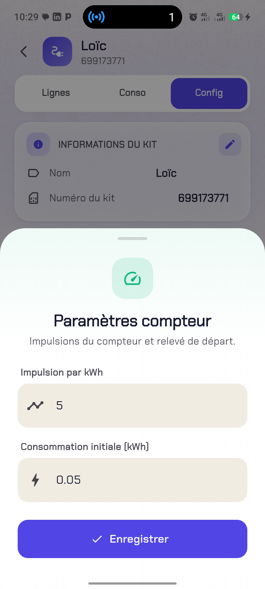

Renseignez le **nombre d'impulsions** du compteur et la **consommation initiale (kWh)** —
le relevé de départ qui sert de base aux calculs.

### 9.3 Autoriser un numéro

Touchez le **+** de la carte *Numéros autorisés* :

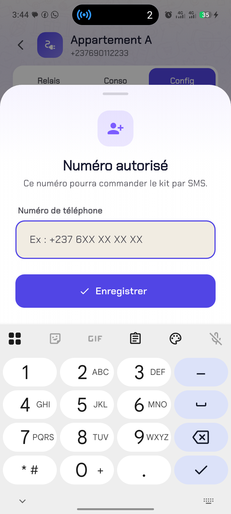

Saisissez le **numéro de téléphone** qui pourra commander le kit par SMS, puis
**Enregistrer**. Pratique pour autoriser, par exemple, un gardien ou un colocataire.

> 🔄 **Important.** Tout numéro autorisé qui installe EnMKit et importe ce kit verra
> l'**état des lignes se synchroniser** automatiquement à chaque confirmation du kit.

---

## 10. Partager la configuration entre deux téléphones (QR Code)

C'est l'un des points forts d'EnMKit pour un bailleur : **dupliquer ou transmettre la
configuration d'un kit d'un téléphone à un autre**, sans tout ressaisir.

### Étape A — Sur le téléphone source : générer le QR Code

Depuis l'onglet **Config**, appuyez sur **« Générer le QR Code »** :

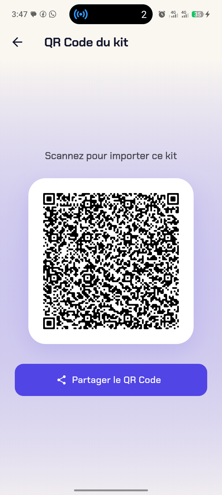

L'écran **« QR Code du kit »** affiche un QR qui **contient toute la configuration
actuelle** (numéro GSM, lignes, etc.). Le bouton **« Partager le QR Code »** permet aussi
de l'envoyer en image (par message, e-mail…).

### Étape B — Sur le téléphone destinataire : scanner pour importer

Sur le **second téléphone**, depuis la liste des kits, appuyez sur l'**icône scanner**
(en haut à droite). À la première utilisation, l'application demande l'accès à la
**caméra** :

| | |
|---|---|
| 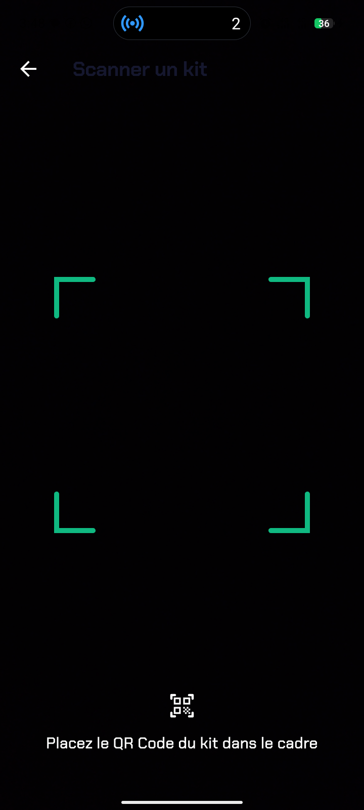 | 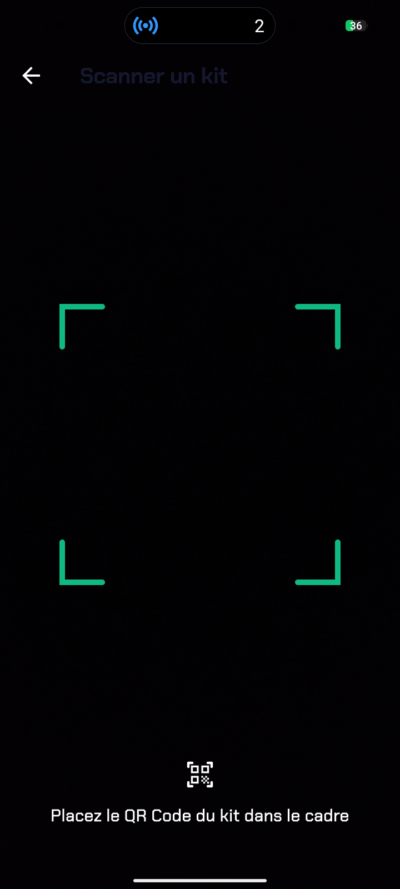 |
| Autorisez l'accès à l'appareil photo (**While using the app**). | Placez le **QR Code** affiché par le premier téléphone **dans le cadre**. |

Dès que le QR est reconnu, le kit (et toute sa configuration) est **importé
automatiquement** sur le second téléphone. Les deux appareils peuvent alors piloter le même
logement.

> 💡 **Cas d'usage bailleur.** Vous configurez tous les appartements sur votre téléphone,
> puis vous transmettez par QR Code l'accès d'un logement précis au locataire ou au gardien
> concerné — sans lui donner accès au reste du parc.
>
> 🛟 **Sauvegarde.** Conservez une copie des QR Codes : ils permettent de **restaurer**
> rapidement un kit en cas de changement de téléphone.

---

## 11. Réglages de l'application

L'onglet **Réglages** (en bas) regroupe la personnalisation et la sécurité.

| | |
|---|---|
| 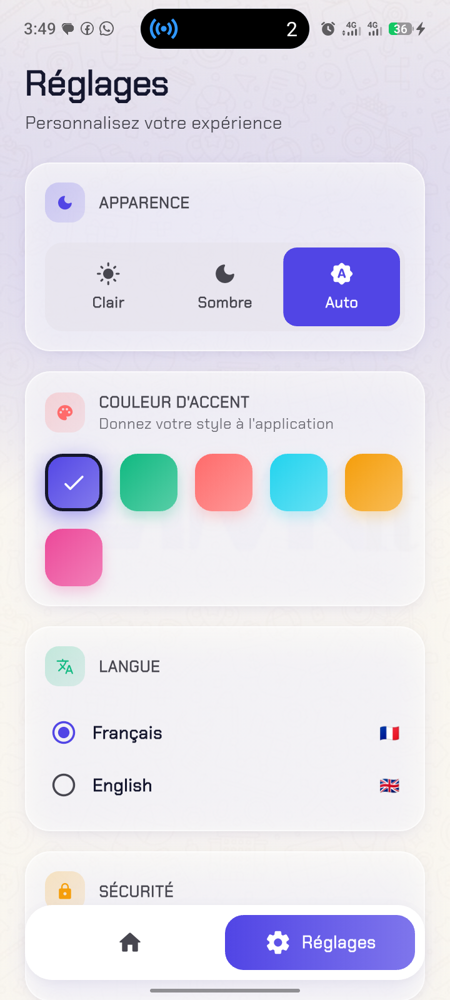 | 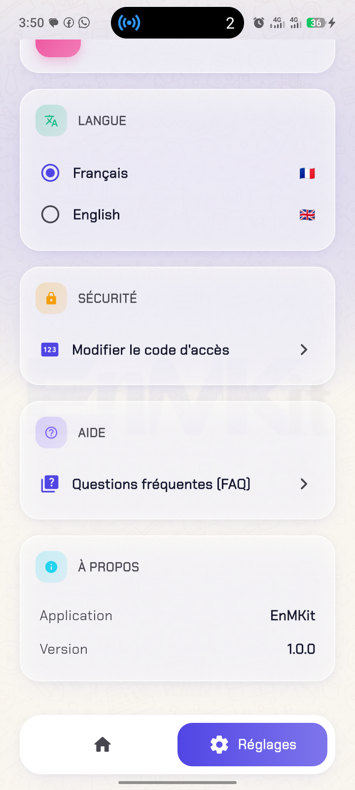 |
| **Apparence** (Clair / Sombre / Auto), **Couleur d'accent**, **Langue** (Français / English). | **Sécurité** (code, **empreinte**, **récupération**), **Aide (FAQ)** et **À propos** (version 1.0.0). |

---

## 12. Sécurité — code, empreinte et récupération

Dans **Réglages → Sécurité**, vous gérez **quatre** éléments :

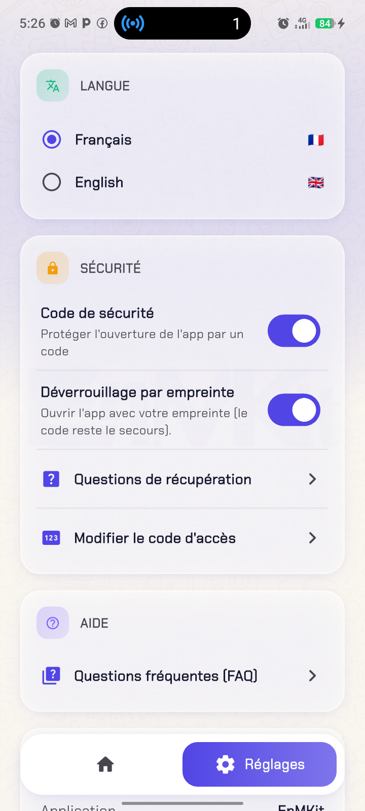

### 12.1 Le code de sécurité

> 🆕 Un **interrupteur** active ou désactive le code d'accès.

- **Activer** : l'application vous propose de **créer** un code (saisie + confirmation).
- **Désactiver** : l'application demande le **code actuel**, puis le supprime.
- **Modifier le code d'accès** (quand la sécurité est active) : saisissez le **code
  actuel**, puis le **nouveau code** et sa **confirmation**, et **Enregistrer**.

### 12.2 🆕 Le déverrouillage par empreinte

L'interrupteur **« Déverrouillage par empreinte »** permet d'**ouvrir l'application avec
votre empreinte digitale** au lieu de saisir le code à chaque fois.

- À l'**activation**, l'application vérifie que votre téléphone possède bien un capteur et
  **au moins une empreinte enregistrée**. Sinon, un message *« Aucune empreinte enregistrée
  sur cet appareil »* s'affiche (enregistrez d'abord une empreinte dans les réglages
  Android).
- Une fois activé, l'écran d'ouverture propose un bouton **« Utiliser l'empreinte »** et
  lance automatiquement l'invite d'empreinte.
- 🔑 **Le code reste le secours** : en cas d'échec de l'empreinte, vous pouvez toujours
  saisir votre code.

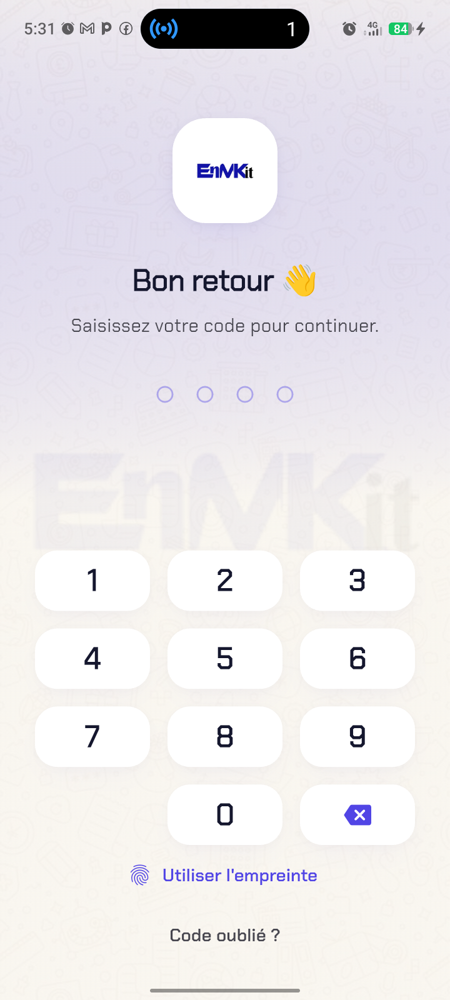

### 12.3 🆕 Les questions de récupération

L'entrée **« Questions de récupération »** vous laisse définir **deux questions secrètes**
et leurs réponses. C'est ce qui permet de **récupérer l'accès** via *« Code oublié ? »*
(voir l'écran d'ouverture) si vous oubliez votre code — sans perdre vos kits.

> ℹ️ Si vous aviez déjà un code dans une version précédente, il a été **conservé** : la
> sécurité reste activée tant que vous ne la désactivez pas.

---

## 13. Aide intégrée (FAQ)

Une **FAQ** est disponible dans **Réglages → Aide**. Elle répond aux questions les plus
fréquentes, classées par thème.

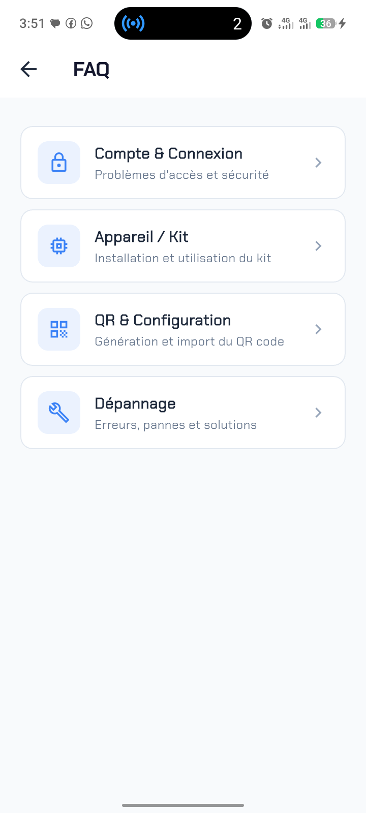

Quatre rubriques : **Compte & Connexion**, **Appareil / Kit**, **QR & Configuration** et
**Dépannage**.

La rubrique **QR & Configuration** détaille justement le partage vu au §10 :

| | |
|---|---|
| 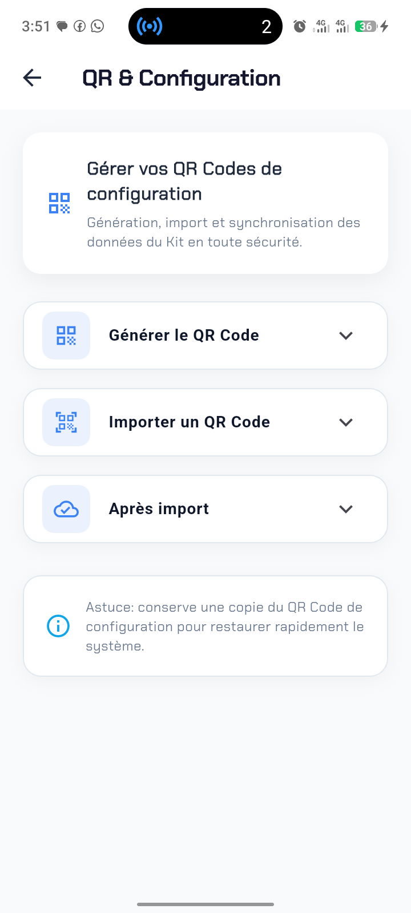 | 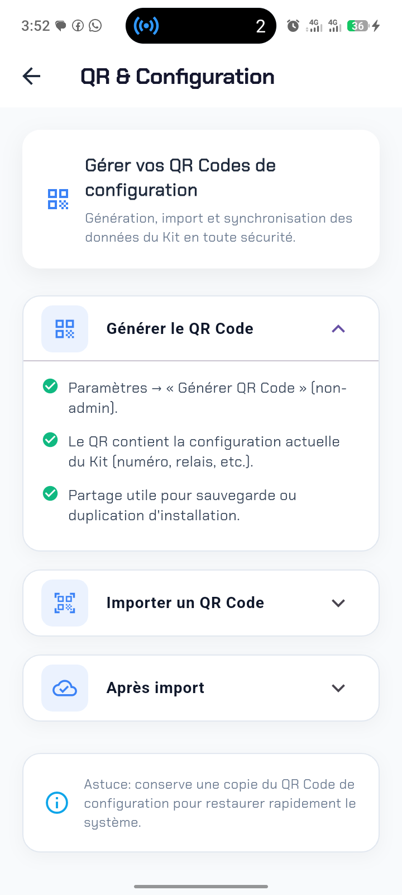 |
| Trois sujets : *Générer le QR Code*, *Importer un QR Code*, *Après import*. | En dépliant, on voit que le QR contient la config du kit et sert à la sauvegarde / duplication. |

---

## 14. Annexe — Les messages SMS échangés avec le kit

> 🔧 **Pour les utilisateurs avancés.** Vous n'avez normalement **rien à taper à la
> main** : l'application compose et envoie ces SMS pour vous quand vous actionnez un
> interrupteur ou un bouton. Cette annexe explique simplement *ce qui circule* entre le
> téléphone et le kit, utile pour comprendre une facture SMS ou diagnostiquer un souci.

**Ce que l'application envoie au kit :**

| Quand vous… | Message envoyé | Le kit répond |
|---|---|---|
| Allumez la ligne *N* | `r<N>on` (ex. `r2on`) | renvoie `r2on` (confirmation) |
| Coupez la ligne *N* | `r<N>off` (ex. `r2off`) | renvoie `r2off` (confirmation) |
| Actualisez la consommation / testez | `cons` | renvoie le relevé en **kWh** |
| Enregistrez le **numéro autorisé 1** | `n1:<numéro>` | renvoie `n1:…` |
| Enregistrez le **numéro autorisé 2** | `n2:<numéro>` | renvoie `n2:…` |
| Réglez la **consommation initiale** | `en:<kWh>` | renvoie `en:…` |
| Réglez les **impulsions** du compteur | `ip:<nombre>` | renvoie `ip:…` |
| Terminez l'envoi de configuration | `Fin_config` | — |

> 📦 **Configuration groupée.** Quand vous appuyez sur **« Envoyer la configuration au
> kit »** (§9), tous les réglages partent dans **un seul SMS**, champs séparés par `;` —
> ex. `n1:+237…;n2:+237…;en:…;ip:…`. Cela limite le nombre de SMS facturés.

**Comment l'application interprète les réponses du kit :**

- Un message contenant **`rNon` / `rNoff`** met à jour l'état (allumée / arrêtée) de la
  ligne *N* — sur **tous les téléphones autorisés**, même application fermée. Il est en
  outre **horodaté et conservé** dans l'**historique des accusés** de la ligne (§6.3),
  avec le **texte brut du message** reçu.
- Un message contenant **« … kWh »** est enregistré comme un relevé de consommation.

> ⚠️ **À ne pas modifier.** Ces mots-clés (`r…on/off`, `cons`, `n1:`, `n2:`, `en:`,
> `ip:`, `Fin_config`) correspondent au **langage du boîtier** : ils ne se changent pas
> côté application. Les numéros sont automatiquement mis au format `+237`.

---

## Récapitulatif — le parcours du bailleur

1. **Installer** l'app ; **activer un code** d'accès seulement si souhaité (§1–2, §12).
2. **Ajouter chaque appartement** comme un kit, avec son numéro GSM et son **nombre de
   lignes** (§4–5).
3. **Nommer et piloter les lignes** de chaque logement par **double-tap**, avec **test de
   joignabilité** et **actions groupées** (§6–7).
4. **Suivre la consommation** (§8).
5. **Configurer** le kit : infos, compteur, numéros autorisés (§9).
6. **Partager / dupliquer** la configuration par **QR Code** entre téléphones — l'état des
   lignes se **synchronise** entre appareils autorisés (§10).
7. **Personnaliser et sécuriser** l'application (§11–12), avec une **FAQ** intégrée (§13).

---

*EnMKit · v1.0.0 — Guide d'utilisation. Captures d'écran réalisées sur l'application réelle
(version actuelle : onglet Lignes, double-tap, sélecteur de lignes, interrupteur Sécurité,
historique des accusés de réception).*
